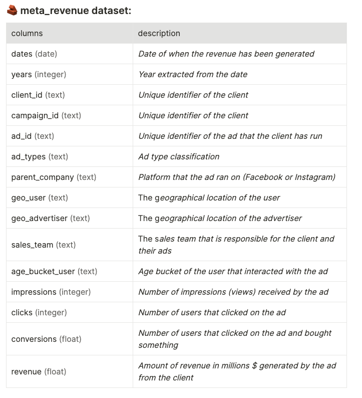

# Meta Revenue

## Description
Meta Revenue is a powerful revenue management system built on PostgreSQL. It provides comprehensive features for tracking, analyzing, and optimizing revenue streams.

## Table 

## Copyright

While the data used & tools are free-to-use & open-source, I will appreciate if the below credits are mentioned if you find using my work & time devoted to this project useful, and you intend to share it in full/parts publicly:

Author: Azam Fatemi

LinkedIn:  [https://www.linkedin.com/in/azam-fatemi](https://www.linkedin.com/in/azam-fatemi)

Github:  [https://github.com/AzamFatemi693/Meta-Revenue](https://github.com/AzamFatemi693/Globox)

